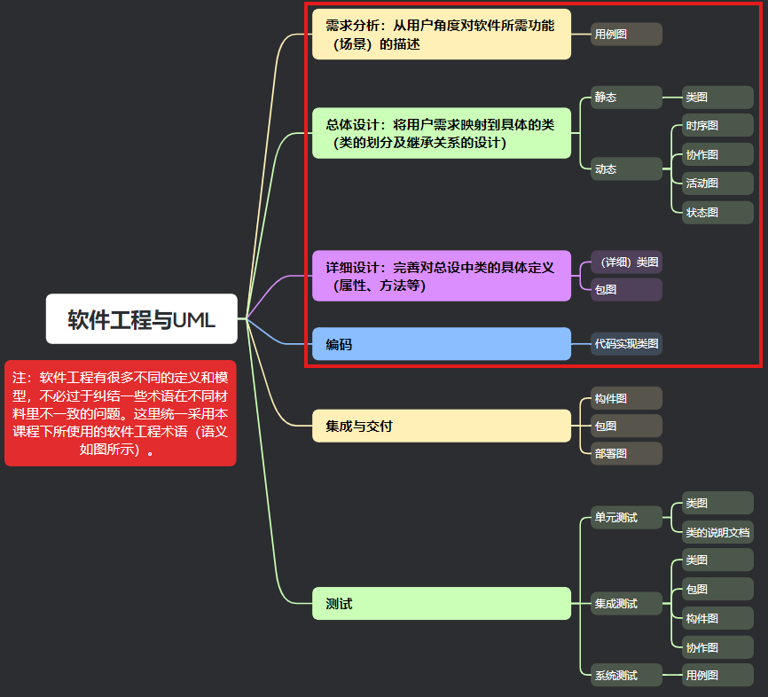

# 实验三报告

> 学号：<学号>
> 
> 姓名：<姓名>
> 
> 指导老师：<指导老师>
> 
> 实验日期：<20XX-XX-XX>

## 一、实验目的

- 复习软件工程的基本概念和方法论；
  - 软件生命周期与开发方法论；
    - 结构化分析与设计（SAD）
    - 面向对象分析与设计（OOAD）
- 掌握OOAD与UML图的对应关系；

  - 注意：UML图只是OOAD中的一部分（代码相关的部分），并不是OOAD的全部。例如：
    - 需求分析除了UML图外，还有文档说明；
    - 总体设计除了UML图外，还有UI设计、数据库设计等；
    - 详细设计除了UML图外，还有算法实现（流程图、N-S图、伪代码）、UI的具体实现、数据库的具体实现等；
- 完成教科书中关系数据库实例的UML建模练习；

## 二、实验内容

- 阅读教科书的第9章“数据管理”的第9.4节“关系数据库的开发”；
- 根据理论课所讲内容和软件工程的相关概念，完成教科书上关系数据库实例的UML建模练习；

## 三、实验要求

- 需求分析：完成用例图和用例规约；
- 总体设计：完成类图（静态视图）和活动图（动态视图）；
- 详细设计：完成详细类图和包图；
- 撰写并提交实验报告；
  - <font color=red>实验步骤部分需严格按模板要求撰写；</font>
  - <font color=red>提交时删除掉上文中的“UML提纲.png“图片；</font>

## 四、实验步骤

### 1. 需求分析

#### 1.1 用例图

<在此处填写你的用例图>

#### 1.2 用例规约

<在此处填写你的用例规约>

用例规约格式示例：   

| 字段 | 内容 |
| ---- | ------ |
| 用例名 | ＜用例名应该是一个主动语态动词短语来表示的用例目标＞ | 
| 执行者 | ＜执行者的角色名称或执行者的描述＞ | 
| 前置条件 | ＜系统处于什么状态，才能执行该用例＞ | 
| 触发事件 | ＜触发事件的描述，如时间、条件等＞ | 
| 主成功场景 | ＜用例的主成功场景，即完成该用例的主要功能＞ | 
| 扩展场景 | ＜用例的扩展场景，即完成该用例的附加功能＞ | 
| 最小保证 | ＜在所有退出操作前，如何保证得到必须的信息＞（如：系统运行失败，将其写入日志文件）| 
| 后置条件 | ＜系统执行完该用例后，达到什么状态＞ | 
| 优先级 | ＜用例的优先级，高、中、低＞ | 
| 频度 | ＜每周、每月、每季度、每年、永不＞ | 
| 输入 | ＜用例的输入，包括数据、文件、网络等＞ | 
| 输出 | ＜用例的输出，包括数据、文件、网络等＞ | 
| 异常 | ＜用例的异常情况，包括输入、输出、系统错误等＞ | 
| 附加信息 | ＜用例的附加信息，如备注、说明等＞ | 

### 2. 总体设计

#### 2.1 类图（静态视图）

<在此处填写你的类图（静态视图）>

#### 2.2 活动图（动态视图）

<在此处填写你的活动图（动态视图）>

### 3. 详细设计

#### 3.1 详细类图

<在此处填写你的详细类图>

#### 3.2 包图

<在此处填写你的包图>

### <font color=red>4. 编码（实验四的内容，提交实验三报告时需删除此部分）

#### 4.1 代码实现

<在此处填写你的代码实现（带必要注释及Markdown语法高亮）>

插入代码的语法示例：
```typescript {.line-numbers}

```

#### 4.2 结果验证

<在此处填写你的结果截图></font>
